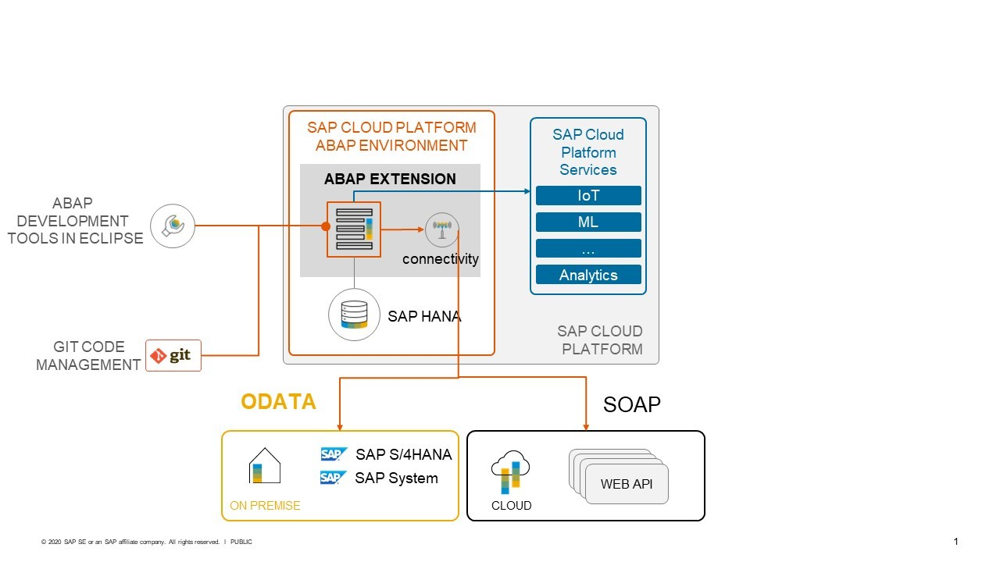

# RAPCJE - SAP Cloud Platform, ABAP Environment Connectivity and Integration

## Description

This repository contains the material for the ABAP RESTful Application Programming Model workshop:
RAPCJE - SAP Cloud Platform, ABAP Environment Connectivity and Integration. 

## Overview

In this session we will show you how you can use SAP Cloud Platform, ABAP environment for side-by-side extension scenarios with SAP S/4 HANA using the ABAP RESTful Application Programming Model 

 

Our scenario is an inventory application that runs on SAP Cloud Platform, ABAP environment. This application will use product master data from an on premise S/4 HANA system that will be retrieved via calling an OData service and via calling a SOAP web service. 

To speed up the development we will use a tool called the RAP Generator that generates the complete stack of a RAP business object based on one or more tables that have to be created beforehand. 

For this workshop we even prepared a class that also creates the table for the inventory data and then calls the RAP Generator to generate the RAP business object on top. This allows us to skip writing lots of boiler plate coding that you otherwise would have to write yourself. 

And we can start much faster with the implementation of our side-by-side integration scenario, so that it fits into the schedule of a 2-hour hands-on session.

## Requirements

- You have created a trial account on SAP Cloud Platform: [Get a Free Trial Account on SAP Cloud Platform](https://developers.sap.com/tutorials/hcp-create-trial-account.html).
- You have installed the ABAP Development Tools (ADT). [Get the ABAP Development Tools (ADT)](https://tools.hana.ondemand.com/#abap), section „Procedure“.
- You have prepared your ABAP Trial which can be easily be done via the [SAP Cloud Platform cockpit](https://cockpit.hanatrial.ondemand.com) in just 3 steps.
  - Click on Enter **Your Trial Account**.
  
  - Click on **Boosters** in the menu on the left hand side
  - Choose the tile **Prepare an Account for ABAP Trial** and follow the wizard
  

For a detailed step-by-step description check out our [Onboarding Tutorial](https://help.sap.com/viewer/65de2977205c403bbc107264b8eccf4b/Cloud/en-US/720c423ef1a8498ab690cf0e5512ba50.html#loio720c423ef1a8498ab690cf0e5512ba50__Create_ABAP_Trial_Instance).

## Download and Installation

You have to download and install the ABAP Development Tools (ADT) as described in section [Requirements](#requirements)

## Known Issues

There are no known issues.

## Exercises

These are the steps of our hands-ons session:

- [Getting Started](exercises/ex0/)
    - [Connect to the system](exercises/ex0#connect-to-the-system)
    - [How do I find out if the suffix of my choice is already used in an ABAP trial system?](exercises/ex0#choose-unique-number-for-the-suffix)
- [Exercise 1 - Generate a starter application](exercises/ex1/README.md)    
    - [Create a package](exercises/ex1#create-a-package)   
    - [Run the RAP Generator](exercises/ex1#generate-a-starter-application)
    - [Check the generated repository objects](exercises/ex1#check-the-generated-repository-objects)
    - [Behavior Implementation](exercises/ex1#behavior-implementation)
    - [Summary](exercises/ex1#summary)
    - [Solution](exercises/ex1/sources)
    
- [Exercise 2 - Consume an OData service](exercises/ex2/README.md)
    - [Create the service consumption model](exercises/ex2#create-the-service-consumption-model)
    - [Create a console application to test the OData service](exercises/ex2#create-a-console-application-to-test-the-odata-service)
     - [Create a custom entity and implement the query implementation class](exercises/ex2#create-a-custom-entity-and-implement-the-query-implementation-class)
         - [Create a custom entity](exercises/ex2#create-a-custom-entity)
         - [Implement the query implemenation class](exercises/ex2#implement-the-query-implemenation-class)     
     - [Add the custom entity as a value help](exercises/ex2#add-the-custom-entity-as-a-value-help)
     - [Test the service](exercises/ex2#test-the-service)
     - [Summary](exercises/ex2#summary) 
     - [Solution](exercises/ex2/sources)

- [Exercise 3 - Consume a SOAP Web service](exercises/ex3/README.md)
    - [Download the WSDL](exercises/ex3#download-the-wsdl)
    - [Create the Service Consumption Model](exercises/ex3#create-the-service-consumption-model)
    - [Add and implement a determination](exercises/ex3/README.md#add-and-implement-a-determination)
    - [Test the service](exercises/ex3/README.md#test-the-service)
    - [Solution](exercises/ex3/sources)
