# Exercise 1

In this exercise, we will create a starter application to collect inventory data. Since we want to concentrate on developing an extension scenario we will try to speed up the process to built the basic inventory application.
 
For this we will use the RAP Generator.

## Connect to the system

1. Start the ABAP Development Tools (aka ABAP in Eclipse)

2. Select a directory as workspace. Click **Launch**

 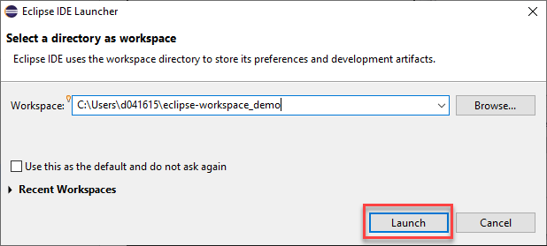

3. Close the Welcome screen

 

4. Check Perspective. If the perspective is still the Java perspective

 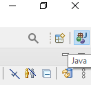

5. Open ABAP perspective (if needed)

  - Click on the **Open perspective** button
  - Select **ABAP**
  - Click **Open**

 

5. Click **File > New > ABAP Cloud Project** to open a new ABAP Cloud project.

 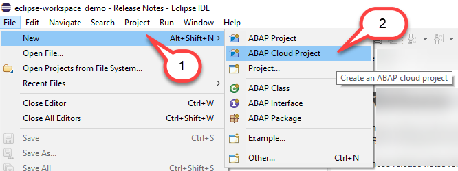

5. Choose the option **SAP Cloud Platform Cloud Foundry Environment** and then click **Next** .

 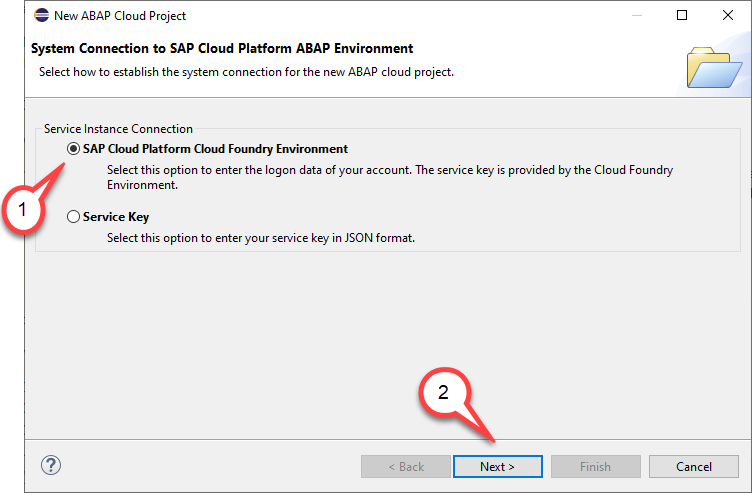

> Here you have to two options how to connect to your SAP Cloud Platform ABAP environment system. We suggest to logon to the SAP Cloud Platform Cloud Foundry Environment and navigate to your ABAP instance. The other option would be to connect directly to the ABAP environment. For this you would have to provide the service key that you have downloaded when setting up your ABAP instance. 

6. Provide the SAP Cloud Foundry connection settings. In this dialogue select the following values

  - Region: Select the region e.g. **Europe (Frankfurt)** or **US East (VA)**.
  - Username: Enter **<your email adress>**
  - Password: Enter **<your password>** you use to log on to SAP Cloud platform
 
  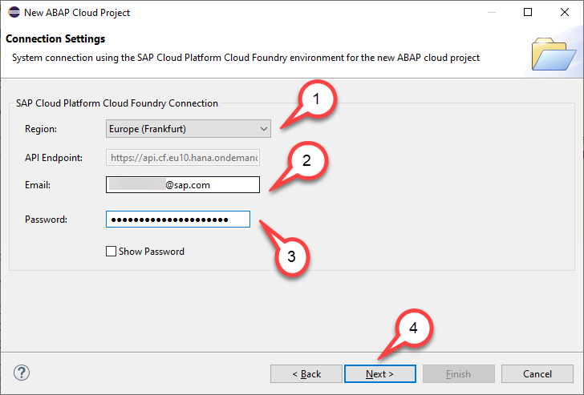

  Click **Next**.

> The API endpoint will be selected according to the region you have chosen.
   
7. Select service instance details

 - Organization: Select your organization e.g. **xxxxxxtrial**
 - Space: Select the space in your CF sub account e.g. **dev**
 - Service instance: Click on the name of your ABAP trial instance e.g. **default_abap-trial**.
 
 Click **Next**.

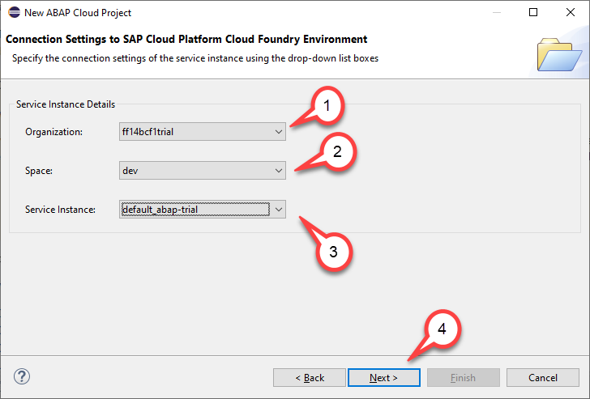

8. Check service connection settings and press **Next**.

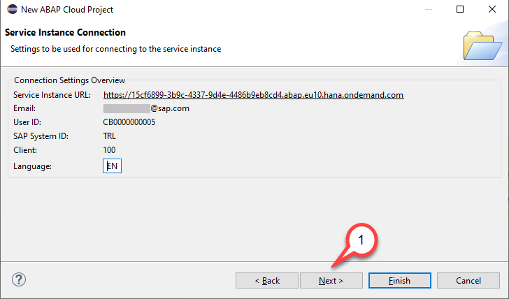

8. You can keep the default project name, e.g. **TRL_EN** unchanged and click **Finish**

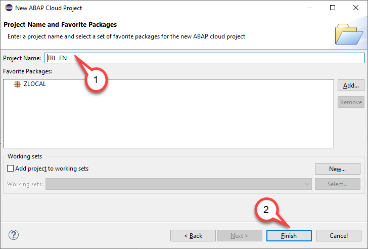

## Create a package

1. Richt-click on **`ZLOCAL`** and from the context menu choose **New > ABAP Package**.

2. In the Create new ABAP package dialogue enter the following values

   - Name: Enter **`ZRAP_INVENTORY_####`** in the field Name.
   - Description: Enter a meaningful description for your package, e.g. **Inventory demo ####**. 

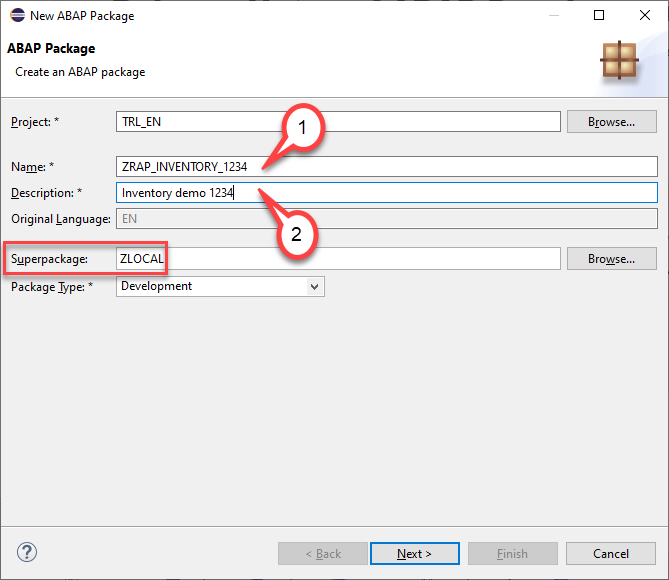

3. Select or create a new transport request

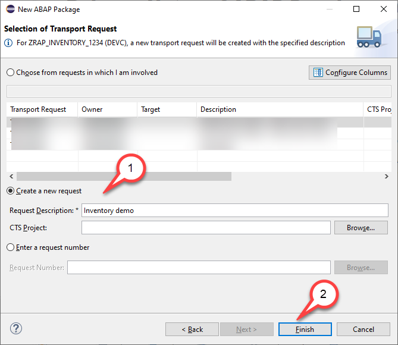

4. Result

You have created a package in the super package ZLOCAL. The package ZLOCAL has a similar role as the package $TMP has in on premise systems.

You can see now an entry in the **Transport Organizer** view
 
> **Caution:**
> If you start developing in a non-trial system you should use sub-packages in ZLOCAL **ONLY** for tests but **NOT** for real development.
> For real development you have to create your own software components and own development packages.

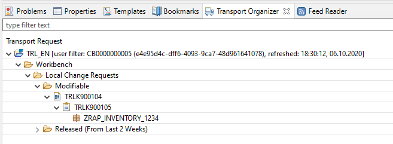

5. Click  Next.

## Create a table

## Generate a starter application

## Summary
You've now ...

Continue to - [Exercise 2 - Exercise 2 Description](../ex2/README.md)

