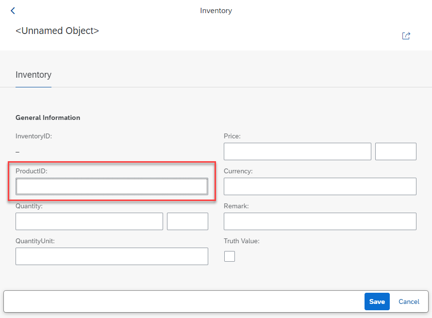
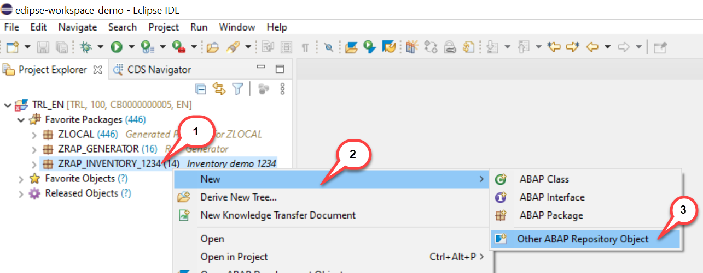
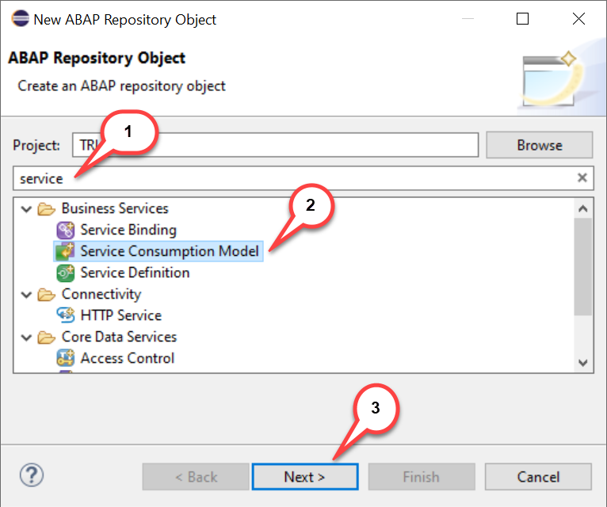
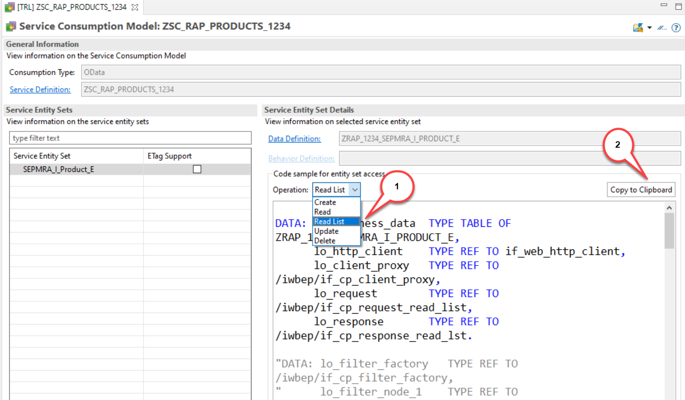

# Exercise 2

When creating a new entry with your inventory application you see that there is no value help for the field ProductId. 
Since this information resides in a SAP S/4 HANA backend we will it retrieve via OData.

 

In this exercise you will thus learn how to consume an OData Service of your on premise system in order to fetch business partner data. You will then learn how to expose this data as a value help for the Inventory entity.

In this exercise, we will ...

  - Create a Service Consumption Model for the on premise OData Service
  - Create a console application to test the OData Service call
  - Create a Custom Entity and implement its custom query
  - Expose your Custom Entity with your existing OData Service
  - Add the Custom Entity as a value help for the ProductId for your inventory application

> Please note:
> Since it must be possible to run this demo on the trial systems where no destination service is available we cannot use RFC calls to retrieve data from a backend system. We  have rather to use services that are publically available in the Internet. In our demo we will thus use an OData Service that is available in the SAP Gateway Demo System ES5  and that does not require any authentication.

## Create the Service Consumption Model

In this step we will generate a so called Service Consumption Model.
This type of object takes an external interface description as its input. 
Currently OData and SOAP are supported. With the upcoming release 2011 it is planned to support Service Consumption Modells for RFC based communication  as well.
Based on the information found in the $metadata file or the wsdl file appropriate repository objects are generated (OData Client proxy or SOAP proxy objects).
Using these objects you will be able to write ABAP code that lets you consume remote OData or SOAP services.
 
 
We start by creating a service consumption model for an OData service that provides demo product data. This service resides on the public SAP Gateway System ES5 and does not require any authentication

> Please note:
> Since it must be possible to run this demo on the trial systems where no destination service is available we have to use services that are publically available in the Internet. In our demo we will thus use an OData Service that is available in the SAP Gateway Demo System ES5 and that does not require any authentication.

1. The $metadata file of the OData service that we want to consume must be uploaded in file format. You have hence to download it first.
 
 - Click on the following URL https://sapes5.sapdevcenter.com/sap/opu/odata/sap/ZPDCDS_SRV/$metadata
 - Download the $metadata file to your computer, you will need it later in this exercise.

2. Switch to ADT and right click on your package . Select **New > Other ABAP Repository Object**.

 

2. In the New ABAP Repository Object dialogue do the following

  -  Start to type **`Service`**
  -  In the list of objects select **Service Conumption Model**
  -  Click **Next**
 
  

4. The **New Service Consumption Model** dialogue opens. Here enter the following data:

   - Name: **ZSC_RAP_PRODUCTS_#### ``**
   - Description: **'Products from ES5`##
   - Remote Consumption Model: **`OData`** (to be selected from the drop down box)
   
   > **Caution**
   
   > Be sure that you have selected **`OData`** as the **Remote Consumption Mode** from the drop down box. We will create a service consumption model for a SOAP web service in the following exercise.
   
    

5. The $metadata file of the OData service that you want to consume must be uploaded in file format. If you have not yet downloaded the $metadata file you have to do this now.

   - Click **Browse** to select the $metadata file that you have downloaded earlier in this exercise
   - Prefix: **`RAP_#### _`** 

> **Please note**

> The prefix that you have entered will be added to the names of the repository objects that are generated, namely the **Service Consumption Model** and the (one or more) **abstract entity**. 
> If you don't select a prefix and if the wizard finds out that there would be name clashes the wizard will propse unique names by adding arbritrary characters to the repository object names. In any case you will be able to change the values that will be proposed by this wizard.

 

6. Check the **ABAP Artifact Name** and click **Next**.

> You will notice that the name of the ABAP artifact has been set to **`ZRAP_####_SEPMRA_I_PRODUCT_E`** since we have provided the prefix **RAP_#### _** 

> If you have not provided a prefix the ABAP Artifact Name might contain several arbritray characters that have been added to the name ZSEPMRA_I_PRODUCT. This can happen if other users in the same system have already imported the same $metadata file. In order to avoid name clashes the wizard then adds arbritrary characters so that a unique name for the ABAP artifact is ensured.

7. In the screen ABAP Artifact Generation List the repository objects that will be generated are shown. This will be
  - The Service Definition: **ZSC_RAP_PRODUCTS_####**
  - The abstract entity: **ZRAP_####_SEPMRA_I_PRODUCT_E**

Click **Next**.

8. Selection of transport request
  - Select or create a transport request
  - Press **Finish**

9. Check out the sample code that is provided for you by the service consumption model. 
  - Operation: Choose the operation **`Read List`**.
  - You can now use the button **Copy to Clipboard** button to copy the sample code for a query. We will use this code in the following step where we create a console application to test the call to the remote OData service. We will later in this exercise then use this code to retrieve a list of ProductIds for your value help.
  
  

## Create a console application to test the OData service

## Create a custom entity

## Create a query implementation class

## Add the custom entity to your service definition

## Add the custom entity as a value help

## Test the service 

## Summary

You've now ...

Continue to - [Exercise 3 - Excercise 3 ](../ex3/README.md)
